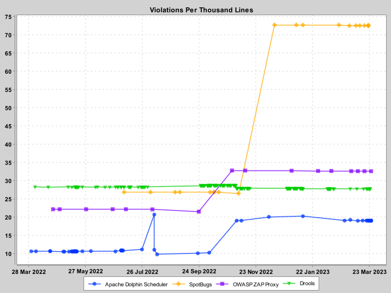
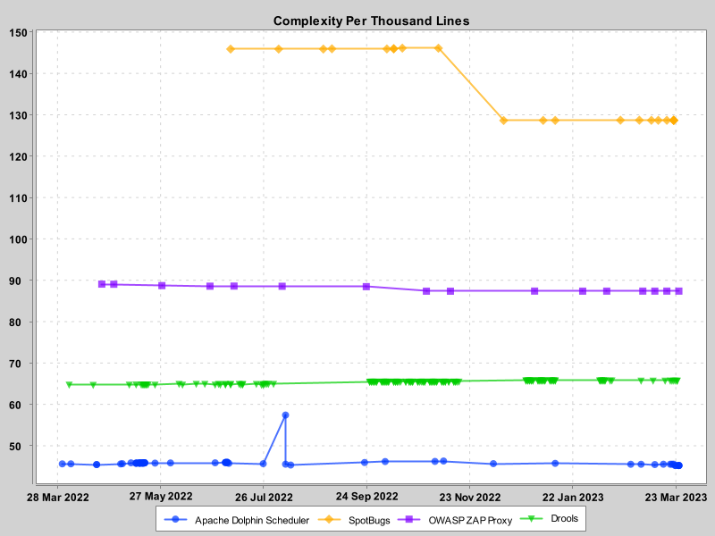
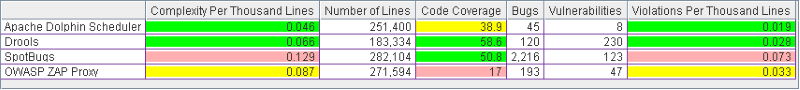

# Management Code Metrics

[](https://sonarcloud.io/summary/new_code?id=larrydiamond_sqgraph)
[](https://sonarcloud.io/summary/new_code?id=larrydiamond_sqgraph)
[](https://sonarcloud.io/summary/new_code?id=larrydiamond_sqgraph)
[](https://sonarcloud.io/summary/new_code?id=larrydiamond_sqgraph)
[](https://sonarcloud.io/summary/new_code?id=larrydiamond_sqgraph)
[](https://sonarcloud.io/summary/new_code?id=larrydiamond_sqgraph)
[](https://sonarcloud.io/summary/new_code?id=larrydiamond_sqgraph)
[](https://app.codacy.com/gh/larrydiamond/sqgraph/dashboard?utm_source=gh&utm_medium=referral&utm_content=&utm_campaign=Badge_grade)

Have you ever asked yourself 'Which of the applications my teams maintain have the cleanest code and which applications need some more attention'?

SonarQube has great tooling to show how each individual project is doing, but doing comparisons between projects has been difficult.

Management Code Metrics reads project histories from SonarCloud or your firm's SonarQube instance and creates charts based on the metrics you are interested in.

## Samples

The Samples directory has two samples in it

The SonarCloud example creates some graphs based on some projects in SonarCloud



The SelfHosted example creates some graphs based on some projects of mine in my self hosted SonarQube instance



And each will produce a dashboard



## Quickstart

To get up and running quickly, please download the Quickstart zip file from the most recent release.

The Quickstart zip file will contain a pre-built jar file as well as the example json files.


## How to build

Windows:
```
.\gradlew build
```

macOS / Linux:
```
./gradlew build
```

## How to run 

Windows:
```
set SONARLOGIN=<your user token>
java -jar build\libs\sqgraph-x.y.z-SNAPSHOT.jar YourJsonFile.json
```

macOS / Linux:
```
export SONARLOGIN=<your user token>
java -jar build/libs/sqgraph-x.y.z-SNAPSHOT.jar YourJsonFile.json
```

## Configuration

sqgraph is driven by a single JSON config file, passed as the command line argument. See [samples/sonarcloud/sonarcloud.json](samples/sonarcloud/sonarcloud.json) for a complete working example.

| Field | Required | Description |
|---|---|---|
| `url` | yes | Base URL of your SonarQube server, or `https://sonarcloud.io` for SonarCloud |
| `applications` | yes | Array of projects to chart, see below |
| `metrics` | yes | Array of metrics to chart, see below |
| `maxReportHistory` | no | How many days of history to fetch, e.g. `366`. Defaults to `0` (no history) if omitted |
| `pdf` | no | If set, also writes a combined PDF report (graphs, descriptions, and a summary dashboard table) to this path |

### `applications[]`

Each entry describes one project, or a search for several, using one of:

| Field | Description |
|---|---|
| `key` + `title` | Chart a single project. `key` is the SonarQube project key, `title` is the display name used in graphs and the PDF |
| `query` | Instead of a single project, search SonarQube (`/api/projects/search`) for every project matching this text and chart all of them. Their names from SonarQube are used as titles |

### `metrics[]`

| Field | Required | Description |
|---|---|---|
| `metric` | yes | A SonarQube metric key (e.g. `coverage`, `bugs`, `ncloc`), or one of the built-in synthetic metrics: `ViolationsPerKLines`, `CognitiveComplexityPerKLines`, `BugsPlusSecurity`, `BugsPlusSecurityPerKLines`; or a custom ratio of two metrics using `<numerator>__PER__<denominator>`, `__PER_K_` (x1000), or `__PER_H_` (x100) |
| `filename` | no | Output PNG filename for this metric's graph. Defaults to the title |
| `title` | no | Chart title, and row label in the PDF dashboard |
| `green` / `yellow` | no | Thresholds that color the PDF dashboard cell green/yellow/pink. If `green > yellow`, higher values are better; if `yellow > green`, lower values are better |
| `description` | no | Explanatory text printed under this metric's graph in the PDF |

## Compatibility
This application has been used with several different versions of SonarQube Community from 8.9 up to 2026.x and with SonarCloud.

The APIs this application needs have not changed in several revisions and are expected to work with SonarQube back to version 6.3 but this has not been tested

If you find a version of this application not working with your SonarQube instance please open a issue and we'll take a look
  
Copyright 2023,2024,2025,2026 Larry Diamond.   All Rights Reserved.

SonarQube and SonarCloud are owned by SonarSource SA
