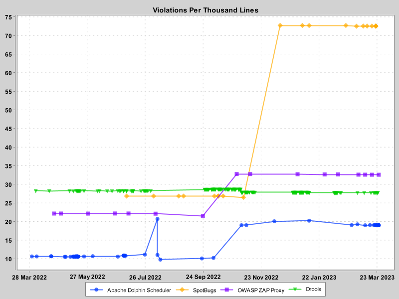

# Management Code Metrics

[](https://sonarcloud.io/summary/new_code?id=larrydiamond_sqgraph)
[](https://sonarcloud.io/summary/new_code?id=larrydiamond_sqgraph)
[](https://sonarcloud.io/summary/new_code?id=larrydiamond_sqgraph)
[](https://sonarcloud.io/summary/new_code?id=larrydiamond_sqgraph)
[](https://sonarcloud.io/summary/new_code?id=larrydiamond_sqgraph)
[](https://sonarcloud.io/summary/new_code?id=larrydiamond_sqgraph)
[](https://sonarcloud.io/summary/new_code?id=larrydiamond_sqgraph)
[](https://sonarcloud.io/summary/new_code?id=larrydiamond_sqgraph)

Have you ever asked yourself 'Which of the applications my teams maintain have the cleanest code and which applications need some more attention'?

SonarQube has great tooling to show how each individual project is doing, but doing comparisons between projects has been difficult.

Management Code Metrics reads project histories from SonarCloud or your firm's SonarQube instance and creates charts based on the metrics you are interested in.

# Samples

The Samples directory has two samples in it

The SonarCloud example creates some graphs based on some projects in SonarCloud


The SelfHosted example creates some graphs based on some projects of mine in my self hosted SonarQube instance


And each will produce a dashboard


# Quickstart

To get up and running quickly, please download the Quickstart zip file from the most recent release.

The Quickstart zip file will contain a pre-built jar file as well as the example json files.


# How to build

```
.\gradlew build
```

# How to run 

```
set SONARLOGIN=<your user token>
java -jar build\libs\sqgraph-x.y.z-SNAPSHOT.jar YourJsonFile.json
```

# Compatibility
This application has been used with several different versions of SonarQube Community from 8.9 up to 10.x and with SonarCloud.

The APIs this application needs have not changed in several revisions and are expected to work with SonarQube back to version 6.3 but this has not been tested

If you find a version of this application not working with your SonarQube instance please open a issue and we'll take a look
  
Copyright 2023 Larry Diamond.   All Rights Reserved.

SonarQube and SonarCloud are owned by SonarSource SA
